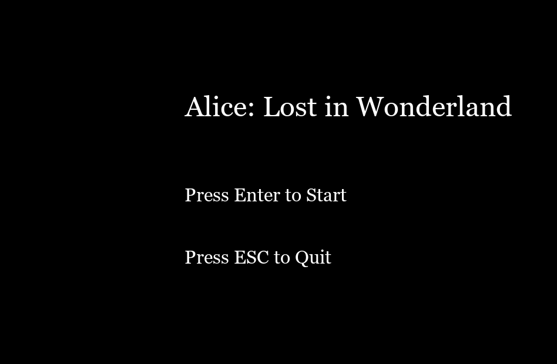

# Changelog

## [Unreleased]
- Expected changes and additions in future versions.

## [0.1.0] - 2025-05-12
### Added
- Initial release of the game "Alice: Lost in Wonderland".
- Added various scenes including "Whispering Woods", "Mad Tea Garden", "Card Kingdom", "Mirror Forest", and "Final Escape".
- Puzzles and challenges for the player to solve in order to collect all 5 keys.
- Basic sound effects for interactions (click, correct answer, wrong answer).
- Main menu with options to start the game or quit.
  
### Fixed
- Initial setup for all scenes and interfaces.
- Fixed logic for player input and response handling.
  
### Changed
- Enhanced game interface design for a better visual experience ().

## [0.0.1] - 2025-05-05
### Added
- Basic game structure.
- Loaded intro image and implemented the basic menu.
- Implemented the first puzzle-solving mechanic.
